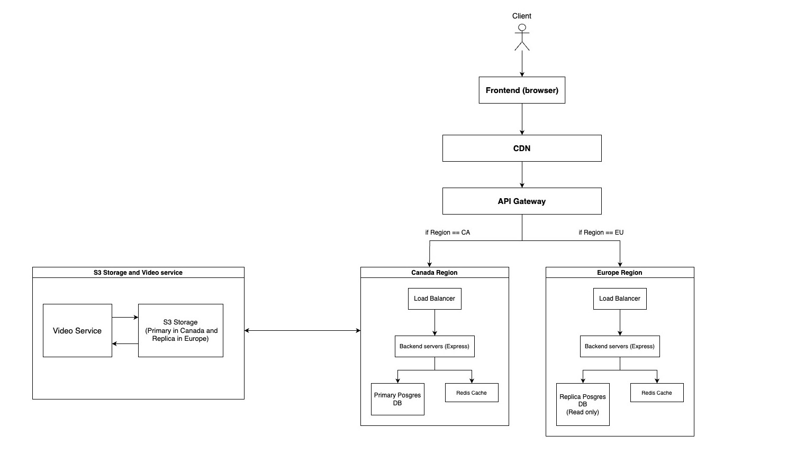

## Introduction

I designed **Venvid**, a scalable video-sharing platform focused on two core features: uploading and viewing videos. The system is optimized for users in Canada and Europe, targeting 20,000 to 50,000 daily active users. It combines a React frontend with a robust backend built for performance, caching, and efficient video processing while keeping it simple.

## [Frontend](./venvid/)

The frontend is built with **React**, using **TypeScript**, **Vite**, and **Bootstrap** for fast development and responsive design. I focused on keeping the UI lightweight and user-friendly.

## Architecture Overview

The system is currently built as a monolith architecture with a region-aware backend setup to ensure low-latency performance and scalability. Below is a high-level diagram of the main components involved in video upload, processing, and playback.

### Components

| Component           | Description                                                                                    |
|---------------------|------------------------------------------------------------------------------------------------|
| **CDN (e.g., CloudFront)** | Caches static assets and video content; routes requests based on user location.                |
| **API Gateway**     | Entry point for all dynamic API traffic; handles routing, authentication, and throttling.      |
| **Load Balancers**  | Regional (Canada & Europe) load balancers that forward requests to origin servers.             |
| **Origin Servers**  | Node.js API servers that handle application logic such as authentication and video metadata.   |
| **Redis (Cache)**   | Stores frequently accessed data like video metadata, views, and likes.                         |
| **Database**        | Primary DB in Canada with a read replica in Europe for low-latency access.                     |
| **S3 (Storage)**    | Stores raw uploaded videos, thumbnails and transcoded outputs (HLS or DASH).                   |
| **Video Service**   | Handles video processing; can be a managed service (e.g., MediaConvert) or background workers. |

## Request Flows and Core Features

### General API Request

When a user performs a simple action like viewing video details, the request goes through several layers to ensure speed, security, and proper routing.

1. The request first reaches the CDN, which checks if the response is already cached.
2. If not cached, the CDN forwards the request to the API Gateway.
3. The API Gateway verifies the request and decides which region (Canada or Europe) should handle it.
4. The request is passed to a regional load balancer.
5. The load balancer forwards it to one of the backend servers.
6. The backend server checks if the data is available in Redis cache.
7. If not found in cache, it reads the data from the database.
8. The response is returned back through the gateway and CDN to the client.

### Uploading a Video

**Flow:**
1. The user should be authenticated
2. The user uploads a video using an upload form in the app.
3. The backend receives the file and stores it in s3 storage.
4. After storing the file, the backend triggers the video service to process and prepare the video for playback.
5. Once processing is complete, the video becomes available for viewing.

### Viewing a Video

**Flow:**
1. The video player in the app sends a request to the backend to retrieve the playback and video information.
2. The backend returns the video metadata including playback manifest.
3. The video starts playing using content served from cloud storage or CDN.

## APIs

The platform exposes a RESTful API for handling user authentication, video uploads, metadata access, and interactions. Below are the key endpoints.

### Auth / User APIs

#### `POST /api/auth/register`
Registers a new user.

#### `POST /api/auth/login`
Authenticates a user and returns a token.

#### `GET /api/users/me`
Returns the current user's profile.

#### `PUT /api/users/me`
Updates the current user's profile.

### Video Metadata and Viewing

#### `GET /api/videos`
Returns a paginated list of videos.

#### `GET /api/videos/:id`
Returns detailed metadata about a specific video including playback url.

### Interaction APIs

#### `POST /api/videos/:id/view`
Records a video view.

#### `POST /api/videos/:id/like`
Likes a video.

#### `DELETE /api/videos/:id/like`
Removes the like from a video.

## Stack and Technologies

I chose a modern and scalable tech stack that supports rapid development and high performance under growing user traffic.

- **Frontend**: Built with React, TypeScript, Vite, and Bootstrap for a fast and modular interface. I use **Zustand** for lightweight and scalable state management, **Zod** for schema-based form validation and data parsing, and **React Query** to handle API communication with built-in caching, background syncing, and request deduplication.

- **Backend**: Implemented with Node.js and Express for flexibility and simplicity in building RESTful APIs.

- **Database**: I use PostgreSQL as the primary relational database because of its strong consistency, extensibility, and SQL support.

- **Caching**: Redis is used for caching frequently accessed data such as views and likes to reduce load on the database and improve response times.

- **Storage and Infrastructure**: AWS is used to host and manage infrastructure including object storage (S3), video processing, and content delivery, helping me keep the system reliable and scalable with minimal overhead.

## Future Improvements and Development

### Microservices Architecture

To improve scalability and maintainability, I plan to refactor the backend into three independent services:

- **User Service**: Manages authentication, user profiles, and session handling.
- **Data Service**: Handles video metadata, views, likes, and comments.
- **Video Service**: Developed in Python to support intensive processing tasks such as transcoding, machine learning-based video analysis, thumbnail generation, and subtitle creation.

This separation will make the system easier to scale independently and support more advanced functionality in the future.

### Frontend Improvement

To enhance SEO and overall performance, I plan to migrate the frontend to **Next.js** for server-side rendering. This will allow video pages to be better indexed by search engines and improve shareability on social platforms.

