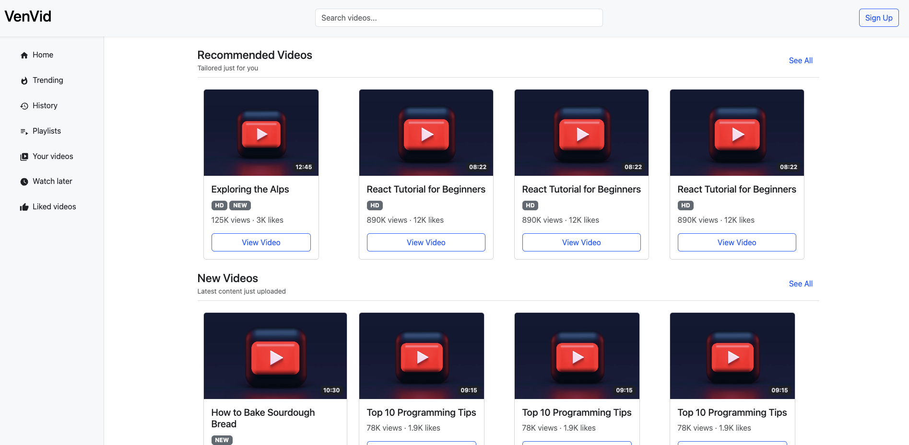

# VenVid

A modern **video-sharing platform UI**, built with **React**, **TypeScript**, **Vite**, and **Bootstrap 5** — inspired by YouTube. The project is focused on clean architecture, reusable components, and responsive design.

---

## Getting Started

### Prerequisites

- Node.js ≥ 16
- npm or yarn

### Setup & Run

```bash
# go to the directory
cd venvid

# Install dependencies
npm install

# Run the development server
npm run dev

# Build for production
npm run build

# Preview production build
npm run preview
```

---

## Folder Structure

```
venvid/
├── public/                  # Static assets
├── src/
│   ├── assets/              # Images and static media
│   ├── components/          # Reusable UI components
│   │   ├── VideoCard/
│   │   ├── VideoList/
│   │   └── SectionTitle/
│   ├── layouts/             # Layout and structural components
│   │   ├── Header/
│   │   ├── Footer/
│   │   ├── Sidebar/
│   │   └── MainLayout.tsx
│   ├── pages/               # Pages (currently only HomePage)
│   ├── services/            # Data-fetching services (future-ready)
│   ├── styles/              # Global CSS and overrides
│   ├── types/               # TypeScript interfaces and types
│   ├── utils/               # Utility functions (e.g., formatNumber)
│   ├── App.tsx              # Root app component
│   └── main.tsx             # Vite entry file
├── index.html               # HTML template
├── package.json             # Project metadata and scripts
├── tsconfig.json            # TypeScript configuration
└── vite.config.ts           # Vite configuration
```

---

## Component Overview

| Component         | Path                          | Description                                           |
|------------------|-------------------------------|-------------------------------------------------------|
| `VideoCard`       | `src/components/VideoCard/`    | Displays a single video’s thumbnail, title, and stats |
| `VideoList`       | `src/components/VideoList/`    | Renders a grid of `VideoCard`s                       |
| `SectionTitle`    | `src/components/SectionTitle/` | Section heading with optional subtitle/action         |
| `Header`          | `src/layouts/Header/`          | Top navigation bar with logo, search, avatar          |
| `Footer`          | `src/layouts/Footer/`          | Bottom footer for site-wide links                     |
| `Sidebar`         | `src/layouts/Sidebar/`         | Left nav bar with navigation items and icons          |
| `SidebarItem`     | `src/layouts/Sidebar/`         | Individual clickable item with icon and title         |
| `MainLayout`      | `src/layouts/MainLayout.tsx`   | Global wrapper that includes header, sidebar, footer  |

## Screenshot

 